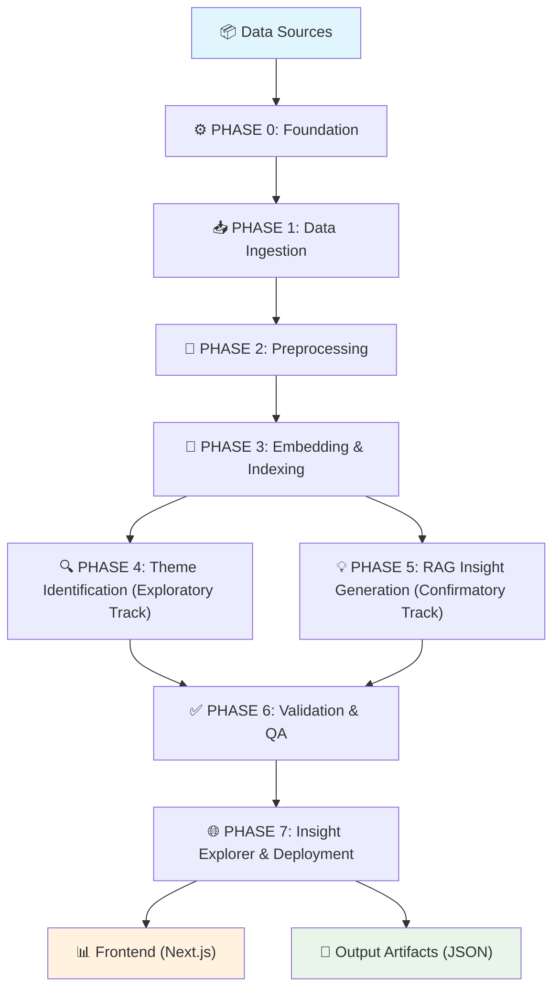
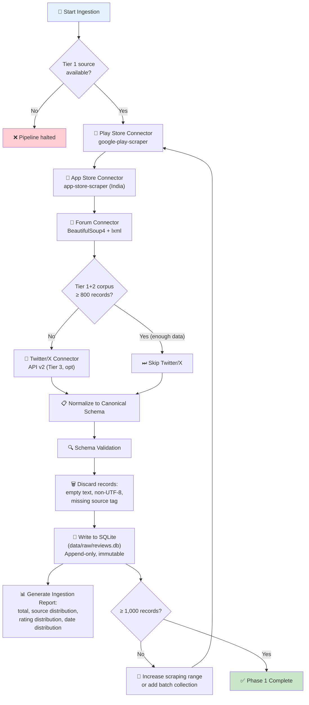
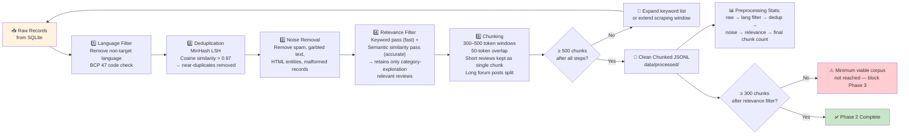
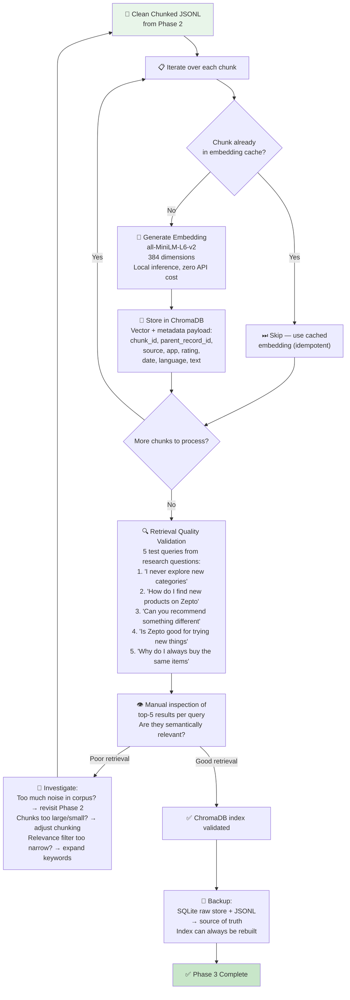
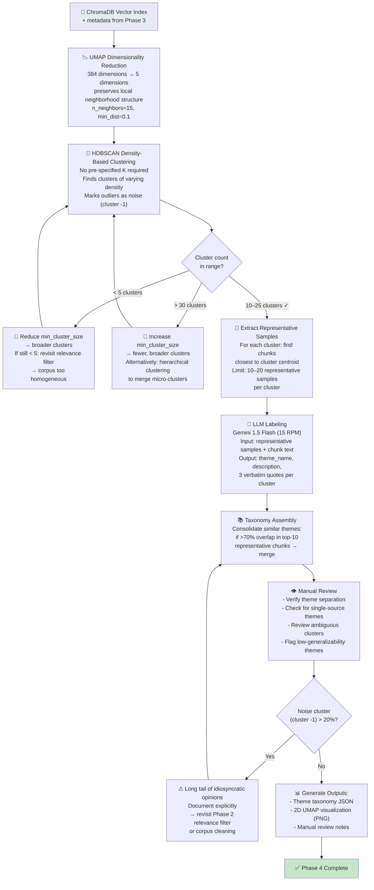
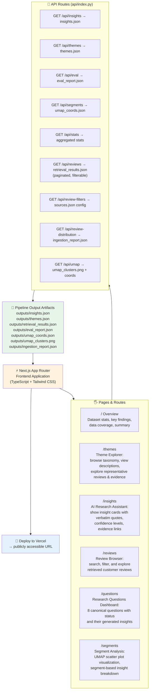
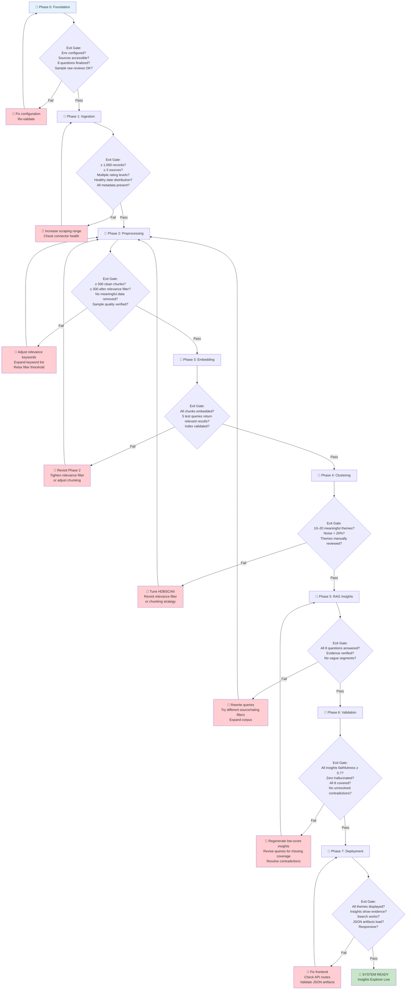

# System Architecture: Zepto AI Review Engine

## Overview

The Zepto AI Review Engine is a RAG (Retrieval-Augmented Generation) pipeline that transforms raw customer feedback from app stores and community forums into structured, evidence-backed product insights. The system operates as a sequential 7-phase pipeline where each phase's output is the next phase's input. A two-track analytical architecture runs in parallel: an exploratory track (clustering) discovers what topics exist in the corpus, and a confirmatory track (RAG) answers pre-defined research questions with grounded evidence.

The pipeline is designed so that a quality failure in an early phase silently degrades everything downstream. Each phase has explicit exit gates and validation criteria.

---

## Mermaid Diagrams

### 1. System Data Flow (End-to-End)



### 2. Data Ingestion Workflow (Phase 1)



### 3. Preprocessing Pipeline (Phase 2)



### 4. Embedding & Vector Indexing (Phase 3)



### 5. Theme Identification — Exploratory Track (Phase 4)



### 6. RAG Insight Generation — Confirmatory Track (Phase 5)

```mermaid
flowchart TD
    VECTORIDX2["🧮 ChromaDB Vector Index<br/>+ metadata from Phase 3"] --> QUERYBUILD["🔧 Query Formulation<br/>Each of the 8 research questions<br/>is rewritten into user voice:<br/>e.g. 'I always buy the same things<br/>every week and never try anything new'<br/>→ matches indexed chunk language"]

    QUERYBUILD --> RETRIEVE["🔍 Semantic Retrieval<br/>RAGRetriever.retrieve_all()<br/>Top-K=10 chunks per query<br/>Metadata filters applied per question:<br/>- rating_lte ≤ 3 for frustration questions<br/>- source filter when needed"]

    RETRIEVE --> DIVERSIFY["🔀 Parent Diversity Enforcement<br/>Max 2 chunks per parent_record_id<br/>Prevents single forum thread<br/>from dominating evidence base<br/>If >2 from same parent → drop excess"]

    DIVERSIFY --> CHECKZERO{"Any results<br/>for this question?"}
    CHECKZERO -- "No" --> INSUFFICIENT["🚫 Mark as<br/>'insufficient evidence'<br/>→ research question has<br/>no corresponding data in corpus"]
    INSUFFICIENT --> NEXTQ{"More questions?"}
    INSUFFICIENT --> NEXTQ
    CHECKZERO -- "Yes" → CONTINUE2{"More questions?"}
    CONTINUE2 -- "Yes" → RETRIEVE
    CONTINUE2 -- "No" -> GENERATE_PROMPT["📝 Build RAG Prompt<br/>For each question with results:<br/>- Retrieved chunks as context<br/>- Structured JSON schema:<br/>  { finding, evidence, implication,<br/>    segment, confidence }<br/>- Explicit instruction: cite only<br/>  retrieved text, no training data"]

    GENERATE_PROMPT → LLM_INFER["🤖 LLM Inference<br/>Gemini 1.5 Flash<br/>15 RPM rate limit<br/>1M tokens/day free tier<br/>Structured JSON output enforced<br/>by Pydantic schema validation"]

    LLM_INFER → VALIDATE_EVIDENCE["✅ Evidence Verification<br/>Programmatic check: each evidence<br/>quote must appear as substring in<br/>at least one retrieved chunk<br/>If paraphrase detected → fail + retry"]

    VALIDATE_EVIDENCE → CHECK_SEGMENT{"Segment field<br/>too vague?<br/>(e.g. 'all users')"}
    CHECK_SEGMENT -- "Yes" → REVISE_SEG["🔁 Return to LLM with<br/>constraint: segment must be<br/>concrete: life stage, use case,<br/>behavior pattern, or geography"]
    REVISE_SEG → LLM_INFER

    CHECK_SEGMENT -- "No" → CHECK_OVERLAP{"Same chunks retrieved<br/>for multiple questions?"}
    CHECK_OVERLAP -- "Yes" → REWRITE_QUERY["🔧 Rewrite queries with more<br/>specific framing or apply<br/>source/rating filters to differentiate"]
    REWRITE_QUERY → RETRIEVE

    CHECK_OVERLAP -- "No" → CROSS_REF["🔗 Cross-Reference Detection<br/>If two questions share >80% chunks<br/>→ consolidate into unified<br/>insight card with combined evidence"]

    CROSS_REF → SAVE["💾 Save to outputs/insights.json<br/>Each insight links back to<br/>chunk_id → SQLite record"]

    SAVE → DONE5["✅ Phase 5 Complete<br/>8 insights (or 'insufficient evidence')"]

    style VECTORIDX2 fill:#e8eaf6
    style DONE5 fill:#c8e6c9
```

### 7. Validation & Quality Assurance (Phase 6)

```mermaid
flowchart TD
    INSIGHTS["💡 Generated Insights<br/>from Phase 5"] --> RAGAS["📊 RAGAS Faithfulness Scoring<br/>Gemini 1.5 Flash as judge LLM<br/>Breaks each insight into individual claims<br/>Checks each claim against evidence chunks<br/>Produces numeric faithfulness score 0–1"]

    RAGAS → SCORES{"Per-insight<br/>scores consistent<br/>across runs?"}
    SCORES -- "Variance > 0.15 between runs" → CONSERVATIVE["📉 Take lower score<br/>as conservative estimate<br/>Do NOT average scores"]
    CONSERVATIVE → EVALUATE
    SCORES -- "Scores consistent" → EVALUATE["📋 Apply Passing Criteria:<br/>- All 8 insights faithfulness ≥ 0.7<br/>- Zero insights rated hallucinated<br/>  by human reviewer<br/>- All 8 research questions covered<br/>- No unresolved contradictions"]

    EVALUATE → LOWCONF{"Any insight<br/>faithfulness < 0.7?"}
    LOWCONF -- "Yes" → MARK_LOW["🏷 Mark as 'low-confidence'<br/>with explanation in report<br/>Do NOT force through if evidence<br/>genuinely doesn't support the claim"]
    MARK_LOW → COVERAGE_CHECK
    LOWCONF -- "No" → COVERAGE_CHECK

    COVERAGE_CHECK["🔍 Coverage Check<br/>Are all 8 research questions<br/>answered with insights?"] → MISSING{"Any missing<br/>insights?"}
    MISSING -- "Yes" → RETURN_P5["🔙 Return to Phase 5<br/>Try different query formulation<br/>or source/rating filter<br/>Re-run retrieval + generation"]
    RETURN_P5 → INSIGHTS
    MISSING -- "No" → CONTRADICT["🔎 Contradiction Detection<br/>Check all pairs of insights for<br/>opposing claims"]

    CONTRADICT → FOUND_CONTRADICT{"Contradictions<br/>found?"}
    FOUND_CONTRADICT -- "Yes" → CLASSIFY{"Genuinely different<br/>user segments?"}
    CLASSIFY -- "Yes" → ANNOTATE["📝 Annotate both insights<br/>with specific segment they apply to<br/>Present as segmentation finding<br/>→ both are valid, keep both"]
    ANNOTATE → HUMAN_CHECK
    CLASSIFY -- "No" → INVESTIGATE["🔍 Investigate retrieval quality<br/>→ different but equally valid evidence<br/>for same question across runs"]
    INVESTIGATE → RETRIEVE2["🔁 Redo retrieval with<br/>more diverse query"]
    RETRIEVE2 → INSIGHTS

    FOUND_CONTRADICT -- "No" → HUMAN_CHECK["👤 Human Spot-Check<br/>5 random insights selected<br/>PM/analyst reads end-to-end<br/>Assess: grounded? genuine? actionable?"]

    HUMAN_CHECK → HALLUCINATED{"Any rated<br/>'hallucinated'?"}
    HALLUCINATED -- "Yes" → REMOVE_REGEN["🗑 Remove hallucinated insight<br/>Regenerate with more specific<br/>query or source filter"]
    REMOVE_REGEN → INSIGHTS
    HALLUCINATED -- "No" → FINAL_EVAL{"All passing<br/>criteria met?"}

    FINAL_EVAL -- "No" → SOFT_FAIL["⚠ Soft failure: system worked<br/>technically but no actionable insights<br/>Revise query formulation →<br/>more specific source filters"]
    SOFT_FAIL → INSIGHTS
    FINAL_EVAL -- "Yes" → PASS["✅ PASS — All criteria met"]
    PASS → EVAL_REPORT["📊 Generate Eval Report JSON:<br/>- Per-insight faithfulness scores<br/>- Coverage status per question<br/>- Contradiction flags<br/>- Spot-check results<br/>- Low-confidence insight count"]

    EVAL_REPORT → DONE6["✅ Phase 6 Complete<br/>Validated insight set ready for deployment"]

    style INSIGHTS fill:#fff3e0
    style DONE6 fill:#c8e6c9
    style PASS fill:#c8e6c9
```

### 8. Frontend Architecture (Phase 7)



### 9. Data Provenance Chain

```mermaid
flowchart LR
    SUB["📝 Raw User Review<br/>Play Store / App Store / Forum"] --> SQLITE["💾 SQLite<br/>(data/raw/reviews.db)<br/>Schema: id, source, app,<br/>text, rating, date,<br/>language, metadata"]

    SQLITE --> PREP["🧹 Preprocessing Pipeline<br/>Phase 2"]
    PREP --> JSONL["📄 Chunked JSONL<br/>(data/processed/)"]

    JSONL --> EMBED["🧮 Embedding Layer<br/>all-MiniLM-L6-v2<br/>384-dim vectors"]
    EMBED --> CHROMA["🔷 ChromaDB Vector Index<br/>(data/embeddings/)"]

    CHROMA --> PHASE4["🔍 Phase 4<br/>Theme Identification<br/>UMAP → HDBSCAN → LLM"]
    CHROMA --> PHASE5["💡 Phase 5<br/>RAG Insight Generation<br/>Semantic Search → LLM Prompt"]

    PHASE4 --> THEMES_JSON["📁 outputs/themes.json"]
    PHASE5 --> INSIGHTS_JSON["📁 outputs/insights.json"]

    PHASE5 --> CHUNKS["📋 Retrieved Chunks<br/>linked by chunk_id<br/>→ back to SQLite record<br/>→ back to original review"]

    CHUNKS --> INSIGHTS_JSON2["📁 outputs/insights.json<br/>Each evidence quote<br/>traces to chunk_id<br/>→ SQLite record ID<br/>→ original review text,<br/>source, date, rating"]

    SQLITE --> INSIGHTS_JSON2
    JSONL --> CHROMA

    INSIGHTS_JSON --> FRONTEND["🌐 Frontend"]
    THEMES_JSON --> FRONTEND

    style SUB fill:#e3f2fd
    style SQLITE fill:#fff9c4
    style CHROMA fill:#e8eaf6
    style INSIGHTS_JSON2 fill="#c8e6c9"
    style FRONTEND fill="#fff3e0"
```

### 10. Phase Validation Gate Architecture



---

## Technology Stack

| Layer | Technology | Rationale |
|---|---|---|
| Language | Python 3.11+ | Standard ML/data engineering environment |
| Embeddings | `sentence-transformers` (`all-MiniLM-L6-v2`) | Local inference, zero API cost, 384-dim vectors |
| Vector DB | ChromaDB (local disk) | Free, zero-config, sufficient for <10K chunks |
| Raw Store | SQLite | Append-only, immutable, single source of truth |
| LLM (free tier) | Gemini 1.5 Flash via Google AI Studio | Free tier (15 RPM, 1M tokens/day), structured JSON output |
| Orchestration | Python scripts (`scripts/run_*.py`) | Sequential pipeline execution |
| Frontend | Next.js + TypeScript + Tailwind CSS | Responsive, API-driven, Vercel deployment |
| Validation | RAGAS (automated) + human spot-check | Faithfulness scoring + qualitative human judgment |
| Testing | Pytest | Standard Python testing framework |

### Rate Limit Management

Gemini 1.5 Flash free tier allows 15 requests/minute. The pipeline makes ~50–60 LLM calls total:
- Phase 4: 10–20 cluster labeling calls
- Phase 5: 8 research question insight calls
- Phase 6: Up to 28 contradiction-check calls

Total completes in 4–5 minutes with no throttling.

---

## Key Design Decisions

### Structural Decisions

1. **RAG over direct LLM summarization** — Every insight claim must cite a retrieved chunk, making hallucination detectable and providing full provenance traceability from insight → chunk → SQLite record.

2. **Two-track pipeline** — Clustering (exploratory) and RAG (confirmatory) both read from the same vector index. Themes from clustering can inform or refine queries in the RAG track.

3. **Focused corpus strategy** — The relevance filter at Phase 2 removes off-topic reviews before embedding. This guarantees high retrieval precision and better clustering quality compared to embedding everything.

4. **SQLite + ChromaDB separation** — The raw store is append-only and immutable. The vector index is rebuilt. Full text always comes from SQLite, never from ChromaDB.

5. **User-voice query formulation** — Research questions are rewritten into the voice of a user experiencing the behavior, not the product manager's analyst language. This matches the semantic space of the indexed chunks.

6. **Structured insight output** — Every insight conforms to a fixed schema (`finding`, `evidence`, `implication`, `segment`). The schema is enforced both at the LLM prompt level and via Pydantic validation.

### Open Decisions

See `docs/decision.md` for the open decision table (D-08 through D-10), covering Hinglish inclusion, low-confidence insight handling, and ChromaDB vs. Pinecone migration.